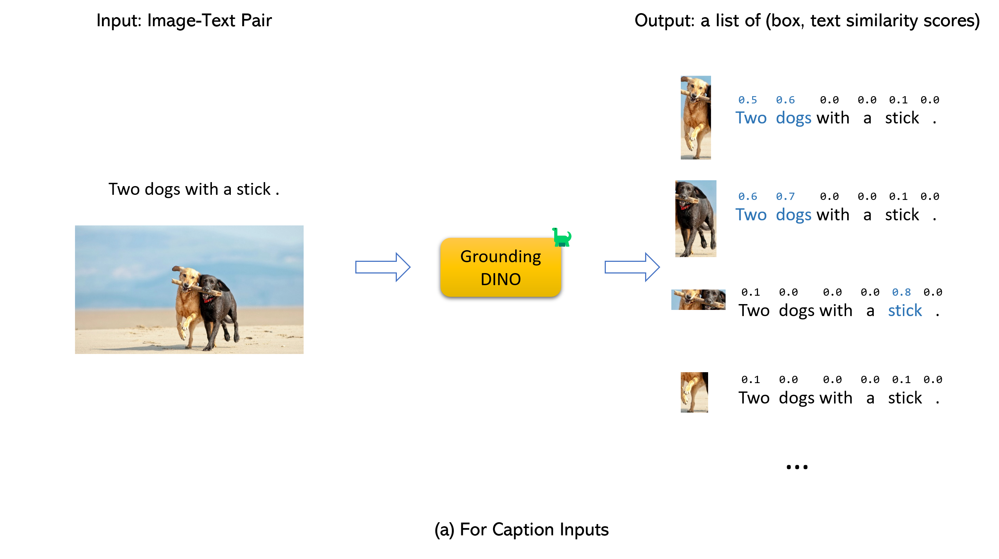
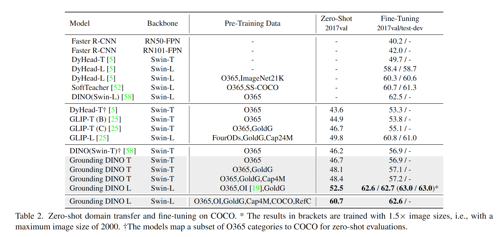
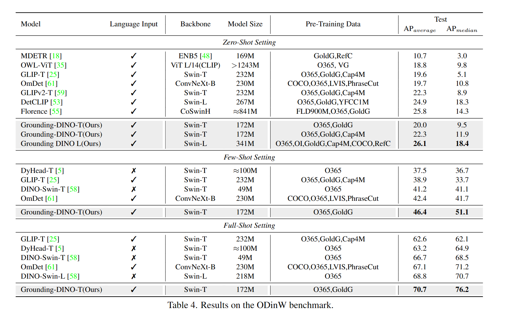
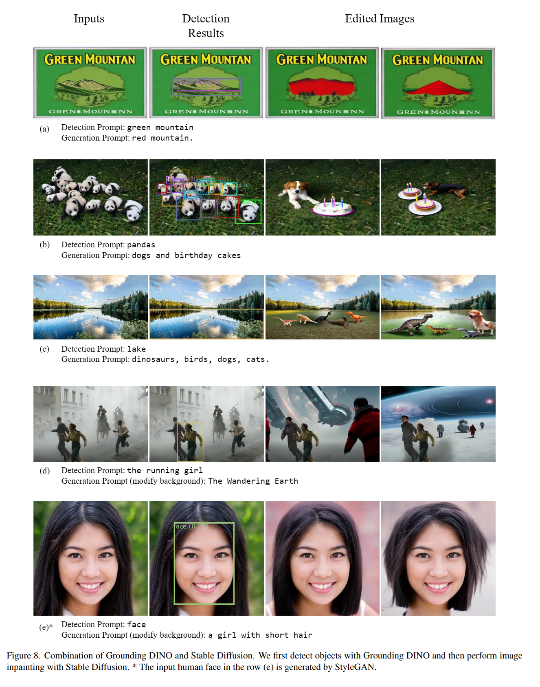

<div align="center">
  
</div>

# :sauropod: Grounding DINO 

[](https://paperswithcode.com/sota/zero-shot-object-detection-on-mscoco?p=grounding-dino-marrying-dino-with-grounded) [](https://paperswithcode.com/sota/zero-shot-object-detection-on-odinw?p=grounding-dino-marrying-dino-with-grounded) \
[](https://paperswithcode.com/sota/object-detection-on-coco-minival?p=grounding-dino-marrying-dino-with-grounded) [](https://paperswithcode.com/sota/object-detection-on-coco?p=grounding-dino-marrying-dino-with-grounded)


**[IDEA-CVR, IDEA-Research](https://github.com/IDEA-Research)** 

[Shilong Liu](http://www.lsl.zone/), [Zhaoyang Zeng](https://scholar.google.com/citations?user=U_cvvUwAAAAJ&hl=zh-CN&oi=ao), [Tianhe Ren](https://rentainhe.github.io/), [Feng Li](https://scholar.google.com/citations?user=ybRe9GcAAAAJ&hl=zh-CN), [Hao Zhang](https://scholar.google.com/citations?user=B8hPxMQAAAAJ&hl=zh-CN), [Jie Yang](https://github.com/yangjie-cv), [Chunyuan Li](https://scholar.google.com/citations?user=Zd7WmXUAAAAJ&hl=zh-CN&oi=ao), [Jianwei Yang](https://jwyang.github.io/), [Hang Su](https://scholar.google.com/citations?hl=en&user=dxN1_X0AAAAJ&view_op=list_works&sortby=pubdate), [Jun Zhu](https://scholar.google.com/citations?hl=en&user=axsP38wAAAAJ), [Lei Zhang](https://www.leizhang.org/)<sup>:email:</sup>.


[[`Paper`](https://arxiv.org/abs/2303.05499)] [[`Demo`](https://huggingface.co/spaces/ShilongLiu/Grounding_DINO_demo)] [[`BibTex`](#black_nib-citation)]


PyTorch implementation and pretrained models for Grounding DINO. For details, see the paper **[Grounding DINO: Marrying DINO with Grounded Pre-Training for Open-Set Object Detection](https://arxiv.org/abs/2303.05499)**.

- 🔥 **[Grounded SAM 2](https://github.com/IDEA-Research/Grounded-SAM-2)** is released now, which combines Grounding DINO with [SAM 2](https://github.com/facebookresearch/segment-anything-2) for any object tracking in open-world scenarios.
- 🔥 **[Grounding DINO 1.5](https://github.com/IDEA-Research/Grounding-DINO-1.5-API)** is released now, which is IDEA Research's **Most Capable** Open-World Object Detection Model!
- 🔥 **[Grounding DINO](https://arxiv.org/abs/2303.05499)** and **[Grounded SAM](https://arxiv.org/abs/2401.14159)** are now supported in Huggingface. For more convenient use, you can refer to [this documentation](https://huggingface.co/docs/transformers/model_doc/grounding-dino)

## :sun_with_face: Helpful Tutorial

- :grapes: [[Read our arXiv Paper](https://arxiv.org/abs/2303.05499)]
- :apple:  [[Watch our simple introduction video on YouTube](https://youtu.be/wxWDt5UiwY8)]
- :blossom:   &nbsp;[[Try the Colab Demo](https://colab.research.google.com/github/roboflow-ai/notebooks/blob/main/notebooks/zero-shot-object-detection-with-grounding-dino.ipynb)]
- :sunflower: [[Try our Official Huggingface Demo](https://huggingface.co/spaces/ShilongLiu/Grounding_DINO_demo)]
- :maple_leaf: [[Watch the Step by Step Tutorial about GroundingDINO by Roboflow AI](https://youtu.be/cMa77r3YrDk)]
- :mushroom: [[GroundingDINO: Automated Dataset Annotation and Evaluation by Roboflow AI](https://youtu.be/C4NqaRBz_Kw)]
- :hibiscus: [[Accelerate Image Annotation with SAM and GroundingDINO by Roboflow AI](https://youtu.be/oEQYStnF2l8)]
- :white_flower: [[Autodistill: Train YOLOv8 with ZERO Annotations based on Grounding-DINO and Grounded-SAM by Roboflow AI](https://github.com/autodistill/autodistill)]

<!-- Grounding DINO Methods | 
[](https://arxiv.org/abs/2303.05499) 
[](https://youtu.be/wxWDt5UiwY8) -->

<!-- Grounding DINO Demos |
[](https://colab.research.google.com/github/roboflow-ai/notebooks/blob/main/notebooks/zero-shot-object-detection-with-grounding-dino.ipynb) -->
<!-- [](https://youtu.be/cMa77r3YrDk)
[](https://huggingface.co/spaces/ShilongLiu/Grounding_DINO_demo)
[](https://youtu.be/oEQYStnF2l8)
[](https://youtu.be/C4NqaRBz_Kw) -->

## :sparkles: Highlight Projects

- [Semantic-SAM: a universal image segmentation model to enable segment and recognize anything at any desired granularity.](https://github.com/UX-Decoder/Semantic-SAM), 
- [DetGPT: Detect What You Need via Reasoning](https://github.com/OptimalScale/DetGPT)
- [Grounded-SAM: Marrying Grounding DINO with Segment Anything](https://github.com/IDEA-Research/Grounded-Segment-Anything)
- [Grounding DINO with Stable Diffusion](demo/image_editing_with_groundingdino_stablediffusion.ipynb)
- [Grounding DINO with GLIGEN for Controllable Image Editing](demo/image_editing_with_groundingdino_gligen.ipynb)
- [OpenSeeD: A Simple and Strong Openset Segmentation Model](https://github.com/IDEA-Research/OpenSeeD)
- [SEEM: Segment Everything Everywhere All at Once](https://github.com/UX-Decoder/Segment-Everything-Everywhere-All-At-Once)
- [X-GPT: Conversational Visual Agent supported by X-Decoder](https://github.com/microsoft/X-Decoder/tree/xgpt)
- [GLIGEN: Open-Set Grounded Text-to-Image Generation](https://github.com/gligen/GLIGEN)
- [LLaVA: Large Language and Vision Assistant](https://github.com/haotian-liu/LLaVA)

<!-- Extensions | [Grounding DINO with Segment Anything](https://github.com/IDEA-Research/Grounded-Segment-Anything); [Grounding DINO with Stable Diffusion](demo/image_editing_with_groundingdino_stablediffusion.ipynb); [Grounding DINO with GLIGEN](demo/image_editing_with_groundingdino_gligen.ipynb)  -->


<!-- Official PyTorch implementation of [Grounding DINO](https://arxiv.org/abs/2303.05499), a stronger open-set object detector. Code is available now! -->


## :bulb: Highlight

- **Open-Set Detection.** Detect **everything** with language!
- **High Performance.** COCO zero-shot **52.5 AP** (training without COCO data!). COCO fine-tune **63.0 AP**.
- **Flexible.** Collaboration with Stable Diffusion for Image Editting.


## :fire: News
- **`2023/07/18`**: We release [Semantic-SAM](https://github.com/UX-Decoder/Semantic-SAM), a universal image segmentation model to enable segment and recognize anything at any desired granularity. **Code** and **checkpoint** are available!
- **`2023/06/17`**: We provide an example to evaluate Grounding DINO on COCO zero-shot performance.
- **`2023/04/15`**: Refer to [CV in the Wild Readings](https://github.com/Computer-Vision-in-the-Wild/CVinW_Readings) for those who are interested in open-set recognition!
- **`2023/04/08`**: We release [demos](demo/image_editing_with_groundingdino_gligen.ipynb) to combine [Grounding DINO](https://arxiv.org/abs/2303.05499) with [GLIGEN](https://github.com/gligen/GLIGEN)  for more controllable image editings.
- **`2023/04/08`**: We release [demos](demo/image_editing_with_groundingdino_stablediffusion.ipynb) to combine [Grounding DINO](https://arxiv.org/abs/2303.05499) with [Stable Diffusion](https://github.com/Stability-AI/StableDiffusion) for image editings.
- **`2023/04/06`**: We build a new demo by marrying GroundingDINO with [Segment-Anything](https://github.com/facebookresearch/segment-anything) named **[Grounded-Segment-Anything](https://github.com/IDEA-Research/Grounded-Segment-Anything)** aims to support segmentation in GroundingDINO.
- **`2023/03/28`**: A YouTube [video](https://youtu.be/cMa77r3YrDk) about Grounding DINO and basic object detection prompt engineering. [[SkalskiP](https://github.com/SkalskiP)]
- **`2023/03/28`**: Add a [demo](https://huggingface.co/spaces/ShilongLiu/Grounding_DINO_demo) on Hugging Face Space!
- **`2023/03/27`**: Support CPU-only mode. Now the model can run on machines without GPUs.
- **`2023/03/25`**: A [demo](https://colab.research.google.com/github/roboflow-ai/notebooks/blob/main/notebooks/zero-shot-object-detection-with-grounding-dino.ipynb) for Grounding DINO is available at Colab. [[SkalskiP](https://github.com/SkalskiP)]
- **`2023/03/22`**: Code is available Now!

<details open>
<summary><font size="4">
Description
</font></summary>
 <a href="https://arxiv.org/abs/2303.05499">Paper</a> introduction.

Marrying <a href="https://github.com/IDEA-Research/GroundingDINO">Grounding DINO</a> and <a href="https://github.com/gligen/GLIGEN">GLIGEN</a>

</details>

## :star: Explanations/Tips for Grounding DINO Inputs and Outputs
- Grounding DINO accepts an `(image, text)` pair as inputs.
- It outputs `900` (by default) object boxes. Each box has similarity scores across all input words. (as shown in Figures below.)
- We defaultly choose the boxes whose highest similarities are higher than a `box_threshold`.
- We extract the words whose similarities are higher than the `text_threshold` as predicted labels.
- If you want to obtain objects of specific phrases, like the `dogs` in the sentence `two dogs with a stick.`, you can select the boxes with highest text similarities with `dogs` as final outputs. 
- Note that each word can be split to **more than one** tokens with different tokenlizers. The number of words in a sentence may not equal to the number of text tokens.
- We suggest separating different category names with `.` for Grounding DINO.



## :label: TODO 

- [x] Release inference code and demo.
- [x] Release checkpoints.
- [x] Grounding DINO with Stable Diffusion and GLIGEN demos.
- [ ] Release training codes.

## :hammer_and_wrench: Install 

**Note:**

0. If you have a CUDA environment, please make sure the environment variable `CUDA_HOME` is set. It will be compiled under CPU-only mode if no CUDA available.

Please make sure following the installation steps strictly, otherwise the program may produce: 
```bash
NameError: name '_C' is not defined
```

If this happened, please reinstalled the groundingDINO by reclone the git and do all the installation steps again.
 
#### how to check cuda:
```bash
echo $CUDA_HOME
```
If it print nothing, then it means you haven't set up the path/

Run this so the environment variable will be set under current shell. 
```bash
export CUDA_HOME=/path/to/cuda-11.3
```

Notice the version of cuda should be aligned with your CUDA runtime, for there might exists multiple cuda at the same time. 

If you want to set the CUDA_HOME permanently, store it using:

```bash
echo 'export CUDA_HOME=/path/to/cuda' >> ~/.bashrc
```
after that, source the bashrc file and check CUDA_HOME:
```bash
source ~/.bashrc
echo $CUDA_HOME
```

In this example, /path/to/cuda-11.3 should be replaced with the path where your CUDA toolkit is installed. You can find this by typing **which nvcc** in your terminal:

For instance, 
if the output is /usr/local/cuda/bin/nvcc, then:
```bash
export CUDA_HOME=/usr/local/cuda
```
**Installation:**

1.Clone the GroundingDINO repository from GitHub.

```bash
git clone https://github.com/IDEA-Research/GroundingDINO.git
```

2. Change the current directory to the GroundingDINO folder.

```bash
cd GroundingDINO/
```

3. Install the required dependencies in the current directory.

```bash
pip install -e .
```

4. Download pre-trained model weights.

```bash
mkdir weights
cd weights
wget -q https://github.com/IDEA-Research/GroundingDINO/releases/download/v0.1.0-alpha/groundingdino_swint_ogc.pth
cd ..
```

## :arrow_forward: Demo
Check your GPU ID (only if you're using a GPU)

```bash
nvidia-smi
```
Replace `{GPU ID}`, `image_you_want_to_detect.jpg`, and `"dir you want to save the output"` with appropriate values in the following command
```bash
CUDA_VISIBLE_DEVICES={GPU ID} python demo/inference_on_a_image.py \
-c groundingdino/config/GroundingDINO_SwinT_OGC.py \
-p weights/groundingdino_swint_ogc.pth \
-i image_you_want_to_detect.jpg \
-o "dir you want to save the output" \
-t "chair"
 [--cpu-only] # open it for cpu mode
```

If you would like to specify the phrases to detect, here is a demo:
```bash
CUDA_VISIBLE_DEVICES={GPU ID} python demo/inference_on_a_image.py \
-c groundingdino/config/GroundingDINO_SwinT_OGC.py \
-p ./groundingdino_swint_ogc.pth \
-i .asset/cat_dog.jpeg \
-o logs/1111 \
-t "There is a cat and a dog in the image ." \
--token_spans "[[[9, 10], [11, 14]], [[19, 20], [21, 24]]]"
 [--cpu-only] # open it for cpu mode
```
The token_spans specify the start and end positions of a phrases. For example, the first phrase is `[[9, 10], [11, 14]]`. `"There is a cat and a dog in the image ."[9:10] = 'a'`, `"There is a cat and a dog in the image ."[11:14] = 'cat'`. Hence it refers to the phrase `a cat` . Similarly, the `[[19, 20], [21, 24]]` refers to the phrase `a dog`.

See the `demo/inference_on_a_image.py` for more details.

**Running with Python:**

```python
from groundingdino.util.inference import load_model, load_image, predict, annotate
import cv2

model = load_model("groundingdino/config/GroundingDINO_SwinT_OGC.py", "weights/groundingdino_swint_ogc.pth")
IMAGE_PATH = "weights/dog-3.jpeg"
TEXT_PROMPT = "chair . person . dog ."
BOX_TRESHOLD = 0.35
TEXT_TRESHOLD = 0.25

image_source, image = load_image(IMAGE_PATH)

boxes, logits, phrases = predict(
    model=model,
    image=image,
    caption=TEXT_PROMPT,
    box_threshold=BOX_TRESHOLD,
    text_threshold=TEXT_TRESHOLD
)

annotated_frame = annotate(image_source=image_source, boxes=boxes, logits=logits, phrases=phrases)
cv2.imwrite("annotated_image.jpg", annotated_frame)
```
**Web UI**

We also provide a demo code to integrate Grounding DINO with Gradio Web UI. See the file `demo/gradio_app.py` for more details.

**Notebooks**

- We release [demos](demo/image_editing_with_groundingdino_gligen.ipynb) to combine [Grounding DINO](https://arxiv.org/abs/2303.05499) with [GLIGEN](https://github.com/gligen/GLIGEN)  for more controllable image editings.
- We release [demos](demo/image_editing_with_groundingdino_stablediffusion.ipynb) to combine [Grounding DINO](https://arxiv.org/abs/2303.05499) with [Stable Diffusion](https://github.com/Stability-AI/StableDiffusion) for image editings.

## COCO Zero-shot Evaluations

We provide an example to evaluate Grounding DINO zero-shot performance on COCO. The results should be **48.5**.

```bash
CUDA_VISIBLE_DEVICES=0 \
python demo/test_ap_on_coco.py \
 -c groundingdino/config/GroundingDINO_SwinT_OGC.py \
 -p weights/groundingdino_swint_ogc.pth \
 --anno_path /path/to/annoataions/ie/instances_val2017.json \
 --image_dir /path/to/imagedir/ie/val2017
```


## :luggage: Checkpoints

<!-- insert a table -->
<table>
  <thead>
    <tr style="text-align: right;">
      <th></th>
      <th>name</th>
      <th>backbone</th>
      <th>Data</th>
      <th>box AP on COCO</th>
      <th>Checkpoint</th>
      <th>Config</th>
    </tr>
  </thead>
  <tbody>
    <tr>
      <th>1</th>
      <td>GroundingDINO-T</td>
      <td>Swin-T</td>
      <td>O365,GoldG,Cap4M</td>
      <td>48.4 (zero-shot) / 57.2 (fine-tune)</td>
      <td><a href="https://github.com/IDEA-Research/GroundingDINO/releases/download/v0.1.0-alpha/groundingdino_swint_ogc.pth">GitHub link</a> | <a href="https://huggingface.co/ShilongLiu/GroundingDINO/resolve/main/groundingdino_swint_ogc.pth">HF link</a></td>
      <td><a href="https://github.com/IDEA-Research/GroundingDINO/blob/main/groundingdino/config/GroundingDINO_SwinT_OGC.py">link</a></td>
    </tr>
    <tr>
      <th>2</th>
      <td>GroundingDINO-B</td>
      <td>Swin-B</td>
      <td>COCO,O365,GoldG,Cap4M,OpenImage,ODinW-35,RefCOCO</td>
      <td>56.7 </td>
      <td><a href="https://github.com/IDEA-Research/GroundingDINO/releases/download/v0.1.0-alpha2/groundingdino_swinb_cogcoor.pth">GitHub link</a>  | <a href="https://huggingface.co/ShilongLiu/GroundingDINO/resolve/main/groundingdino_swinb_cogcoor.pth">HF link</a> 
      <td><a href="https://github.com/IDEA-Research/GroundingDINO/blob/main/groundingdino/config/GroundingDINO_SwinB_cfg.py">link</a></td>
    </tr>
  </tbody>
</table>

## :medal_military: Results

<details open>
<summary><font size="4">
COCO Object Detection Results
</font></summary>

</details>

<details open>
<summary><font size="4">
ODinW Object Detection Results
</font></summary>

</details>

<details open>
<summary><font size="4">
Marrying Grounding DINO with <a href="https://github.com/Stability-AI/StableDiffusion">Stable Diffusion</a> for Image Editing
</font></summary>
See our example <a href="https://github.com/IDEA-Research/GroundingDINO/blob/main/demo/image_editing_with_groundingdino_stablediffusion.ipynb">notebook</a> for more details.

</details>


<details open>
<summary><font size="4">
Marrying Grounding DINO with <a href="https://github.com/gligen/GLIGEN">GLIGEN</a> for more Detailed Image Editing.
</font></summary>
See our example <a href="https://github.com/IDEA-Research/GroundingDINO/blob/main/demo/image_editing_with_groundingdino_gligen.ipynb">notebook</a> for more details.

</details>

## :sauropod: Model: Grounding DINO

Includes: a text backbone, an image backbone, a feature enhancer, a language-guided query selection, and a cross-modality decoder.


## :hearts: Acknowledgement

Our model is related to [DINO](https://github.com/IDEA-Research/DINO) and [GLIP](https://github.com/microsoft/GLIP). Thanks for their great work!

We also thank great previous work including DETR, Deformable DETR, SMCA, Conditional DETR, Anchor DETR, Dynamic DETR, DAB-DETR, DN-DETR, etc. More related work are available at [Awesome Detection Transformer](https://github.com/IDEACVR/awesome-detection-transformer). A new toolbox [detrex](https://github.com/IDEA-Research/detrex) is available as well.

Thanks [Stable Diffusion](https://github.com/Stability-AI/StableDiffusion) and [GLIGEN](https://github.com/gligen/GLIGEN) for their awesome models.


## :black_nib: Citation

If you find our work helpful for your research, please consider citing the following BibTeX entry.   

```bibtex
@article{liu2023grounding,
  title={Grounding dino: Marrying dino with grounded pre-training for open-set object detection},
  author={Liu, Shilong and Zeng, Zhaoyang and Ren, Tianhe and Li, Feng and Zhang, Hao and Yang, Jie and Li, Chunyuan and Yang, Jianwei and Su, Hang and Zhu, Jun and others},
  journal={arXiv preprint arXiv:2303.05499},
  year={2023}
}
```


