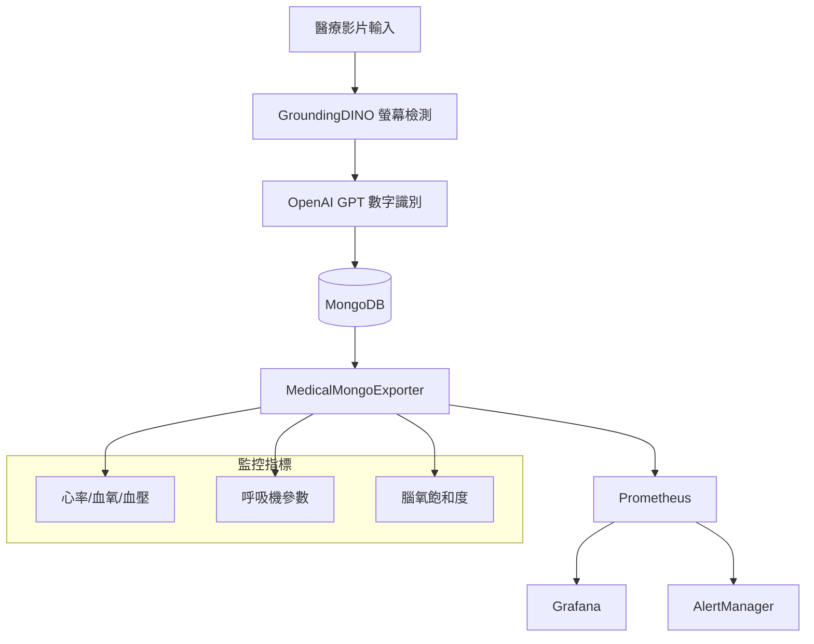
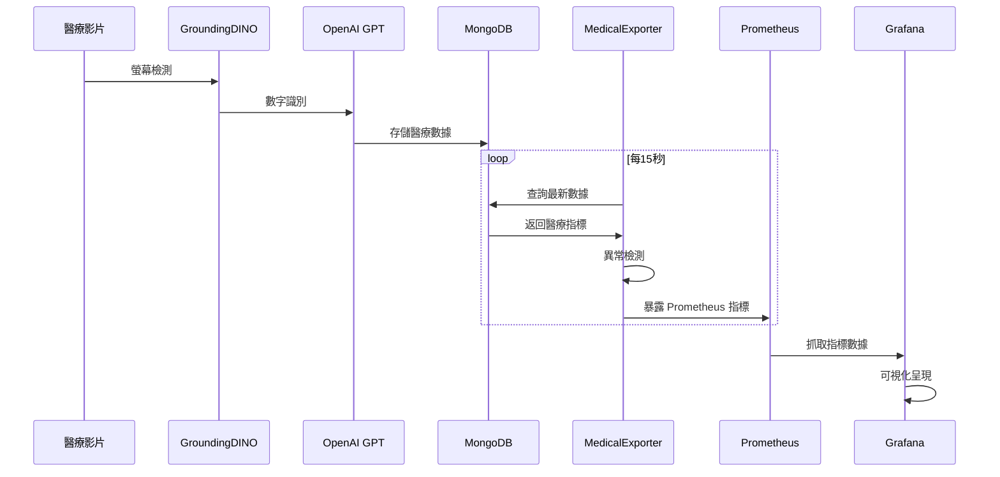

# 🏥 MongoDB 到 Prometheus 醫療數據監控系統

**版本**: 1.0.0  
**日期**: 2025-11-18  
**專案**: Medical Video Processing System - Monitoring Enhancement

---

## 📋 系統概述

這是一個完整的醫療影片處理監控系統，將 MongoDB 中的醫療數據轉換為 Prometheus 時間序列格式，為醫師提供即時的患者數據監控儀表板。

### 🎯 主要功能

- **即時監控**: 15秒間隔更新患者生理指標
- **多設備支持**: 支持 Philips MP20、Dräger C500、SOMANETICS INVOS 等醫療設備
- **異常檢測**: 自動檢測並警報異常醫療數值
- **可視化儀表板**: 豐富的 Grafana 儀表板顯示
- **歷史趨勢**: 支持歷史數據查詢和趨勢分析

### 🏗️ 系統架構



---

## 🚀 快速開始

### 前置需求

- **Python 3.8+**
- **MongoDB** (本地或遠端)
- **Docker & Docker Compose**
- **Git**

### 安裝步驟

1. **克隆專案**
   ```bash
   git clone <repository-url>
   cd GroundingDINO
   ```

2. **安裝依賴**
   ```bash
   pip install -r requirements.txt
   ```

3. **啟動監控系統**
   ```bash
   ./start_medical_monitoring.sh
   ```

4. **訪問服務**
   - **Grafana 儀表板**: http://localhost:3001 (admin/medical123)
   - **Prometheus**: http://localhost:9090
   - **Medical Exporter Metrics**: http://localhost:8000/metrics

### 🎯 一鍵啟動

系統提供了完整的自動化腳本：

```bash
# 啟動所有服務
./start_medical_monitoring.sh

# 停止所有服務
./stop_medical_monitoring.sh

# 執行系統測試
./test_medical_monitoring.sh
```

---

## 📊 監控指標

### 生理指標 (Patient Metrics)

| 指標名稱 | 類型 | 描述 | 標籤 |
|---------|------|------|------|
| `patient_heart_rate_bpm` | Gauge | 患者心率 (每分鐘心跳數) | session_id, device_model, patient_id |
| `patient_spo2_percentage` | Gauge | 血氧飽和度 (%) | session_id, device_model, patient_id |
| `patient_respiration_rate_per_minute` | Gauge | 呼吸頻率 (每分鐘) | session_id, device_model, patient_id |
| `patient_blood_pressure_systolic_mmhg` | Gauge | 收縮壓 (mmHg) | session_id, device_model, patient_id |
| `patient_blood_pressure_diastolic_mmhg` | Gauge | 舒張壓 (mmHg) | session_id, device_model, patient_id |

### 呼吸機參數 (Ventilator Metrics)

| 指標名稱 | 類型 | 描述 |
|---------|------|------|
| `ventilator_fio2_percentage` | Gauge | 吸氧濃度 (%) |
| `ventilator_peep_cmh2o` | Gauge | 呼氣末正壓 (cmH2O) |
| `ventilator_pip_cmh2o` | Gauge | 吸氣壓峰值 (cmH2O) |
| `ventilator_pinsp_cmh2o` | Gauge | 吸氣壓力 (cmH2O) |

### 腦氧監測 (Cerebral Monitoring)

| 指標名稱 | 類型 | 描述 |
|---------|------|------|
| `cerebral_rso2_left_percentage` | Gauge | 左腦氧飽和度 (%) |
| `cerebral_rso2_right_percentage` | Gauge | 右腦氧飽和度 (%) |

### 系統指標 (System Metrics)

| 指標名稱 | 類型 | 描述 |
|---------|------|------|
| `medical_alerts_total` | Counter | 醫療異常警報總數 |
| `active_medical_sessions_total` | Gauge | 活躍的醫療監控會話數量 |
| `data_processing_duration_seconds` | Histogram | 數據處理持續時間 |
| `mongodb_query_duration_seconds` | Histogram | MongoDB 查詢持續時間 |
| `last_successful_scrape_timestamp` | Gauge | 最後成功抓取時間戳記 |

---

## 📈 Grafana 儀表板

### 患者監控儀表板
**訪問路徑**: http://localhost:3001/d/patient-monitoring-dashboard

**功能特色**:
- 即時生理指標監控 (心率、血氧、血壓、呼吸)
- 呼吸機參數趨勢
- 腦氧飽和度監控
- 異常值高亮顯示
- 患者篩選器

### 系統總覽儀表板
**訪問路徑**: http://localhost:3001/d/system-overview-dashboard

**功能特色**:
- 系統健康狀態
- 警報統計和趨勢
- 效能指標監控
- 設備在線狀態
- 服務可用性監控

---

## ⚠️ 警報設定

### 危急警報 (Critical)

- **心率異常**: < 40 或 > 180 bpm
- **血氧危急**: < 90%
- **血壓危急**: 收縮壓 > 180 或 < 90 mmHg
- **腦氧過低**: < 50%

### 警告 (Warning)

- **心率偏高/偏低**: 100-120 或 50-60 bpm
- **血氧偏低**: 90-95%
- **呼吸頻率異常**: < 10 或 > 35 /min
- **呼吸機參數異常**: PEEP > 20, PIP > 40

### 警報配置檔案

警報規則定義在 [`alerts/medical_alerts.yml`](alerts/medical_alerts.yml) 中，支持客製化修改。

---

## 🔧 設定與配置

### Medical Exporter 配置

編輯 [`medical_mongodb_exporter.py`](medical_mongodb_exporter.py) 中的參數：

```python
exporter = MedicalMongoExporter(
    mongodb_uri="mongodb://localhost:27017",
    database_name="medical_monitor_db",
    metrics_port=8000,
    scrape_interval=15  # 15秒更新間隔
)
```

### MongoDB 連接設定

```bash
# 環境變數設定
export MONGODB_URI="mongodb://localhost:27017"
export DATABASE_NAME="medical_monitor_db"

# 或使用命令行參數
python3 medical_mongodb_exporter.py --mongodb-uri mongodb://localhost:27017
```

### Prometheus 設定

編輯 [`prometheus.yml`](prometheus.yml) 來調整抓取間隔或添加新的監控目標。

---

## 🎛️ 進階使用

### 手動啟動組件

如果需要分別啟動各個組件：

```bash
# 1. 啟動 MongoDB (如果尚未啟動)
python3 -c "from mongo_manager import start_local_mongodb; start_local_mongodb()"

# 2. 啟動 Medical Exporter
python3 medical_mongodb_exporter.py

# 3. 啟動監控服務
docker-compose -f docker-compose.monitoring.yml up -d
```

### 自定義警報

1. 編輯 [`alerts/medical_alerts.yml`](alerts/medical_alerts.yml)
2. 重啟 Prometheus: `docker-compose -f docker-compose.monitoring.yml restart prometheus`

### 添加新設備支持

1. 更新 [`templates/`](templates/) 目錄中的設備模板
2. 修改 [`medical_mongodb_exporter.py`](medical_mongodb_exporter.py) 中的設備映射
3. 重新部署系統

---

## 📊 資料流程



---

## 🚨 故障排除

### 常見問題

1. **MongoDB 連接失敗**
   ```bash
   # 檢查 MongoDB 狀態
   python3 -c "from mongo_manager import get_mongo_manager; get_mongo_manager().connect_to_mongodb()"
   ```

2. **Exporter 無法啟動**
   ```bash
   # 檢查端口佔用
   netstat -tuln | grep 8000
   
   # 查看詳細日誌
   tail -f medical_exporter.log
   ```

3. **Grafana 無法訪問**
   ```bash
   # 檢查容器狀態
   docker-compose -f docker-compose.monitoring.yml ps
   
   # 重啟 Grafana
   docker-compose -f docker-compose.monitoring.yml restart grafana
   ```

詳細的故障排除指南請參考 [`TROUBLESHOOTING.md`](TROUBLESHOOTING.md)。

---

## 📝 開發說明

### 專案結構

```
GroundingDINO/
├── medical_mongodb_exporter.py    # 核心導出器
├── prometheus.yml                 # Prometheus 配置
├── docker-compose.monitoring.yml  # Docker 編排
├── alerts/
│   └── medical_alerts.yml         # 警報規則
├── grafana/
│   ├── dashboards/                # 儀表板定義
│   └── provisioning/              # 資料源配置  
├── start_medical_monitoring.sh    # 啟動腳本
├── stop_medical_monitoring.sh     # 停止腳本
├── test_medical_monitoring.sh     # 測試腳本
└── templates/                     # 設備模板
    ├── philips.txt
    ├── drager.txt
    └── manetics.txt
```

### 擴展開發

要添加新的醫療指標：

1. 在 [`medical_mongodb_exporter.py`](medical_mongodb_exporter.py) 中添加新的 Prometheus 指標
2. 更新 `_update_vital_signs()` 方法處理新參數
3. 添加對應的警報規則
4. 更新 Grafana 儀表板

---

## 📞 技術支持

### 效能指標

- **MongoDB 查詢響應時間**: < 2秒
- **Prometheus 指標更新延遲**: < 15秒  
- **記憶體使用量**: < 500MB
- **CPU 使用率**: < 10% (正常運行時)

### 版本資訊

- **系統版本**: 1.0.0
- **Python**: 3.8+
- **MongoDB**: 4.4+
- **Prometheus**: 2.40+
- **Grafana**: 9.3+

### 聯繫資訊

如需技術支持，請查閱：
- [`TROUBLESHOOTING.md`](TROUBLESHOOTING.md) - 故障排除指南
- 系統日誌: `medical_exporter.log`
- 測試工具: `./test_medical_monitoring.sh`

---

**最後更新**: 2025-11-18  
**文檔版本**: 1.0.0