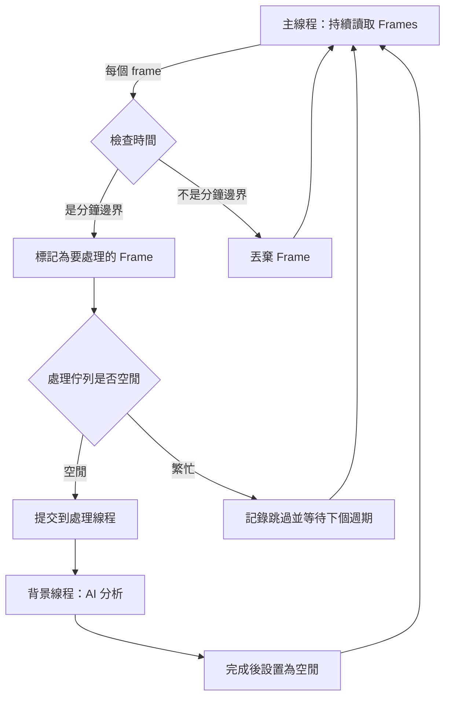
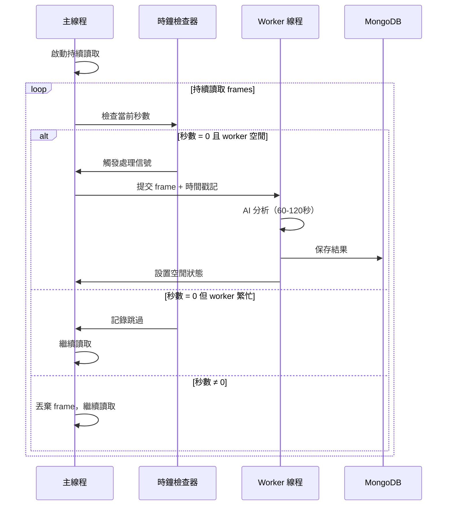

# Process Camera Stream 分鐘同步分析與設計方案

## 📋 需求分析

### 使用者需求
1. **精確時間同步**：在每一分鐘的第 0 秒抓取 frame 並分析
2. **處理長時間**：考慮處理時間可能超過 60 秒的情況
3. **連續讀取保證**：必須持續讀取中間的 frames，確保要處理的 frame 是精確時間點的最新畫面

### 技術挑戰
- 當前的 Connect-Capture-Close 模式不適合此需求
- 視訊緩衝區問題：如果不持續讀取，緩衝區會累積舊畫面
- 時間漂移問題：處理時間長時，如何保持與分鐘邊界同步
- 並行處理：如何同時進行 frame 讀取和 AI 分析

---

## 🔍 當前實作分析

### 現有 `process_camera_stream` 的問題

從 [video_screen_digit_extractor.py](video_screen_digit_extractor.py:695) 的實作來看：

```python
# 第 765-772 行：當前的時間控制邏輯
if current_time - last_process_time < interval_seconds:
    time.sleep(1)  # 還沒到時間，休息一下
    continue
```

**問題點：**

1. **相對時間控制**
   - 使用 `last_process_time` 作為基準
   - 是「完成時間」而非「開始時間」
   - 無法對齊絕對時間邊界（如每分鐘的第 0 秒）

2. **Connect-Capture-Close 模式的限制**
   ```python
   # 第 779-799 行：每次都重新連接
   cap = cv2.VideoCapture(source)
   # ... 讀取 5 個 frames
   cap.release()  # 立即釋放
   ```
   - 適合處理間隔大於處理時間的情況
   - 不適合需要持續讀取的場景
   - 如果處理時間 > 60 秒，會完全偏離時間軸

3. **時間漂移範例**
   ```
   假設：處理時間 = 65 秒，interval = 60 秒
   
   00:00  開始處理 Frame #1
   01:05  Frame #1 處理完成，更新 last_process_time
   01:05  檢查：current_time(01:05) - last_process_time(01:05) < 60? YES
   01:06  檢查：current_time(01:06) - last_process_time(01:05) < 60? YES
   ...
   02:05  檢查：current_time(02:05) - last_process_time(01:05) < 60? NO
   02:05  開始處理 Frame #2  ❌ 應該在 02:00，實際在 02:05
   ```

---

## ✅ 解決方案設計

### 核心策略

採用 **「持續讀取 + 時間標記 + 背景處理」** 架構：



### 設計原則

1. **主線程職責**：持續讀取 frames，清空緩衝區
2. **時間判定**：基於系統絕對時間（分鐘邊界）
3. **並行處理**：使用 threading 或 multiprocessing 進行 AI 分析
4. **跳過機制**：當處理時間過長時，跳過該週期，等待下個分鐘邊界

---

## 🏗️ 技術實作方案

### 方案 A：使用 Threading（推薦）

**優點：**
- 實作簡單
- 共享記憶體，資料傳遞容易
- 適合 I/O 密集型任務

**缺點：**
- Python GIL 限制，但對於 I/O 和 OpenCV 操作影響較小

**架構圖：**



### 方案 B：使用 Queue + Thread Pool

**優點：**
- 更好的任務管理
- 可配置 worker 數量
- 適合未來擴展（如多攝影機）

**缺點：**
- 實作較複雜
- 需要處理佇列管理

---

## 📝 詳細實作規格

### 1. 時間同步機制

```python
import time
from datetime import datetime

def get_next_minute_boundary():
    """計算下一個分鐘邊界的時間戳記"""
    now = datetime.now()
    next_minute = now.replace(second=0, microsecond=0)
    next_minute = next_minute + timedelta(minutes=1)
    return next_minute.timestamp()

def is_at_minute_boundary(tolerance_ms=100):
    """檢查是否在分鐘邊界（容許誤差）"""
    now = datetime.now()
    return now.microsecond < tolerance_ms * 1000
```

### 2. 連續讀取機制

```python
# 保持連接，持續讀取
cap = cv2.VideoCapture(source)

while True:
    ret, frame = cap.read()  # 持續讀取，不要 release
    
    if not ret:
        # 處理讀取失敗：重連
        cap.release()
        time.sleep(1)
        cap = cv2.VideoCapture(source)
        continue
    
    current_time = datetime.now()
    
    # 檢查是否在分鐘邊界
    if current_time.second == 0 and current_time.microsecond < 100000:
        # 這是要處理的 frame
        process_frame(frame, current_time)
```

### 3. 背景處理機制

**方案：使用 Threading + Flag**

```python
import threading
from queue import Queue, Empty

class FrameProcessor:
    def __init__(self):
        self.processing = False  # 處理中標誌
        self.worker_thread = None
        self.results_queue = Queue()
    
    def is_busy(self):
        return self.processing
    
    def submit_frame(self, frame, timestamp):
        """提交 frame 到背景處理"""
        if self.is_busy():
            print(f"⚠️ 跳過 {timestamp}，上一個處理尚未完成")
            return False
        
        self.processing = True
        self.worker_thread = threading.Thread(
            target=self._process_frame_async,
            args=(frame.copy(), timestamp)
        )
        self.worker_thread.start()
        return True
    
    def _process_frame_async(self, frame, timestamp):
        """背景線程執行的分析"""
        try:
            # 保存 frame
            filepath = self._save_frame(frame, timestamp)
            
            # AI 分析（耗時操作）
            result = self._analyze_frame(filepath)
            
            # 保存到 MongoDB
            self._save_to_db(result, timestamp)
            
            self.results_queue.put(result)
        except Exception as e:
            print(f"❌ 處理錯誤: {e}")
        finally:
            self.processing = False  # 釋放
```

### 4. 主迴圈整合

```python
def process_camera_stream_minute_sync(
    self, 
    camera_index=0, 
    rtsp_url=None,
    max_duration=None, 
    output_dir="video_screen_analysis",
    save_to_mongodb=True, 
    session_id=None
):
    """
    精確分鐘邊界同步的攝影機處理
    
    特點：
    1. 在每分鐘的第 0 秒抓取 frame
    2. 持續讀取中間 frames 以清空緩衝區
    3. 處理時間超過 60 秒時自動跳過
    """
    
    # 初始化
    processor = FrameProcessor()
    cap = cv2.VideoCapture(source)
    start_time = time.time()
    frame_count = 0
    skip_count = 0
    
    # 等待到下一個分鐘邊界開始
    wait_until_next_minute_boundary()
    
    try:
        while True:
            # === 持續讀取 frame ===
            ret, frame = cap.read()
            
            if not ret:
                # 重連邏輯
                cap.release()
                time.sleep(1)
                cap = cv2.VideoCapture(source)
                continue
            
            # === 檢查時間 ===
            now = datetime.now()
            
            # 只在分鐘邊界處理（秒數為 0）
            if now.second == 0 and now.microsecond < 100000:
                # 避免在同一秒內重複觸發
                if hasattr(self, '_last_trigger_minute'):
                    if self._last_trigger_minute == now.minute:
                        continue  # 已經處理過這一分鐘
                
                self._last_trigger_minute = now.minute
                
                # 檢查 processor 是否空閒
                if processor.submit_frame(frame, now):
                    frame_count += 1
                    print(f"✅ 已提交 Frame #{frame_count} at {now.strftime('%H:%M:%S')}")
                else:
                    skip_count += 1
                    print(f"⏭️ 跳過 Frame at {now.strftime('%H:%M:%S')} (處理中)")
            
            # === 檢查最大執行時間 ===
            if max_duration and (time.time() - start_time) > max_duration:
                break
            
            # 短暫睡眠以降低 CPU 使用率
            time.sleep(0.01)  # 10ms
    
    finally:
        cap.release()
        # 等待最後的處理完成
        if processor.worker_thread and processor.worker_thread.is_alive():
            processor.worker_thread.join(timeout=300)  # 最多等 5 分鐘
```

---

## 🎯 處理長時間處理的策略

### 情境分析

```
情境 1：處理時間 < 60 秒
00:00:00  觸發 Frame #1
00:00:45  Frame #1 處理完成
01:00:00  觸發 Frame #2 ✅

情境 2：處理時間 = 65 秒
00:00:00  觸發 Frame #1
01:00:00  Frame #1 仍在處理中，跳過 ⏭️
01:05:00  Frame #1 處理完成
02:00:00  觸發 Frame #2 ✅

情境 3：處理時間 = 125 秒
00:00:00  觸發 Frame #1
01:00:00  Frame #1 仍在處理中，跳過 ⏭️
02:00:00  Frame #1 仍在處理中，跳過 ⏭️
02:05:00  Frame #1 處理完成
03:00:00  觸發 Frame #2 ✅
```

### 跳過計數與告警

```python
# 記錄跳過次數
if skip_count > 3:
    print(f"⚠️ 警告：已連續跳過 {skip_count} 個週期")
    print(f"   建議：減少處理負載或增加硬體資源")

# 計算實際處理率
processing_rate = frame_count / (frame_count + skip_count) * 100
print(f"📊 處理成功率: {processing_rate:.1f}%")
```

---

## 🔧 關鍵技術細節

### 1. 避免分鐘邊界重複觸發

```python
# 問題：在 00:00:00.000 到 00:00:00.099 之間可能讀取多個 frames
# 解決：記錄上次觸發的分鐘數

if now.second == 0:
    if not hasattr(self, '_last_trigger_minute'):
        self._last_trigger_minute = -1
    
    if self._last_trigger_minute != now.minute:
        self._last_trigger_minute = now.minute
        # 處理這個 frame
```

### 2. Frame 複製的重要性

```python
# ❌ 錯誤：傳遞 frame 引用
processor.submit_frame(frame, timestamp)

# ✅ 正確：傳遞 frame 副本
processor.submit_frame(frame.copy(), timestamp)
```

原因：OpenCV 的 `frame` 是共享緩衝區，下次 `read()` 會覆蓋。

### 3. 緩衝區清空頻率

```python
# RTSP 流的 FPS 通常是 25-30
# 持續讀取可確保緩衝區不累積

while True:
    ret, frame = cap.read()  # 約 33ms（30 FPS）
    # ... 時間檢查只需幾微秒
    time.sleep(0.01)  # 總計約 43ms/次
```

實際讀取頻率：約 23 FPS，足以清空緩衝區。

### 4. 容錯與重連機制

```python
consecutive_failures = 0
MAX_FAILURES = 5

while True:
    ret, frame = cap.read()
    
    if not ret:
        consecutive_failures += 1
        print(f"⚠️ 讀取失敗 ({consecutive_failures}/{MAX_FAILURES})")
        
        if consecutive_failures >= MAX_FAILURES:
            print("🔄 重新連接...")
            cap.release()
            time.sleep(2)
            cap = cv2.VideoCapture(source)
            consecutive_failures = 0
        
        continue
    
    consecutive_failures = 0  # 重置
```

---

## 📊 效能考量

### CPU 使用率優化

| 方法 | CPU 使用率 | 緩衝區清空效果 |
|-----|-----------|---------------|
| 無 sleep | ~25% | 優秀 |
| sleep(0.01) | ~5% | 良好 |
| sleep(0.05) | ~1% | 中等 |
| sleep(0.1) | ~0.5% | 較差 |

**建議**：使用 `time.sleep(0.01)`，在 CPU 使用率和緩衝區效果間取得平衡。

### 記憶體管理

```python
# 定期清理已處理的 frames
if frame_count % 10 == 0:
    # 清理臨時檔案
    cleanup_old_frames(frames_dir, keep_last=10)
```

---

## 🧪 測試計劃

### 單元測試

1. **時間邊界檢測測試**
   ```python
   def test_minute_boundary_detection():
       # 測試在 00:00:00.050 能正確觸發
       # 測試在 00:00:01.000 不會觸發
   ```

2. **跳過機制測試**
   ```python
   def test_skip_when_busy():
       # 模擬處理時間 > 60 秒
       # 驗證跳過計數正確
   ```

### 整合測試

1. **長時間運行測試**（3 小時）
   - 驗證時間漂移 < 500ms
   - 驗證記憶體使用穩定

2. **網路中斷恢復測試**
   - 模擬 RTSP 中斷
   - 驗證自動重連

### 壓力測試

- 處理時間：30秒、60秒、90秒、120秒
- 驗證各情境下的行為正確性

---

## 📋 實作檢查清單

### 核心功能
- [ ] 實作 `process_camera_stream_minute_sync` 函數
- [ ] 實作 `FrameProcessor` 類別（threading 版本）
- [ ] 實作時間邊界檢測邏輯
- [ ] 實作跳過機制
- [ ] 實作重連邏輯

### 輔助功能
- [ ] 添加詳細的日誌記錄
- [ ] 添加統計資訊（處理率、跳過率）
- [ ] 添加告警機制（連續跳過 > 3 次）
- [ ] 添加 MongoDB 整合
- [ ] 添加配置選項（容許誤差、最大等待時間等）

### 測試
- [ ] 編寫單元測試
- [ ] 編寫整合測試
- [ ] 執行長時間運行測試
- [ ] 執行壓力測試

### 文檔
- [ ] 更新 README
- [ ] 添加使用範例
- [ ] 添加疑難排解指南

---

## 🚀 使用範例

### 基本使用

```python
from video_screen_digit_extractor import ScreenDigitExtractor

extractor = ScreenDigitExtractor(
    grounding_model_path="groundingdino_swint_ogc.pth",
    target_data="bpDiastolic"
)

# 每分鐘的第 0 秒處理一次
extractor.process_camera_stream_minute_sync(
    rtsp_url="rtsp://192.168.1.100:8554/stream",
    max_duration=3600,  # 執行 1 小時
    output_dir="minute_sync_analysis"
)
```

### 進階配置

```python
extractor.process_camera_stream_minute_sync(
    rtsp_url="rtsp://192.168.1.100:8554/stream",
    max_duration=None,  # 無限制
    output_dir="minute_sync_analysis",
    save_to_mongodb=True,
    session_id="production_001",
    tolerance_ms=100,  # 時間容許誤差 100ms
    reconnect_attempts=3,  # 重連嘗試次數
    verbose=True  # 詳細日誌
)
```

---

## 🎓 總結

### 核心改進

1. **從相對時間改為絕對時間**
   - 原：`current_time - last_process_time < interval`
   - 新：`datetime.now().second == 0`

2. **從 Connect-Capture-Close 改為持續連接**
   - 原：處理前連接，處理後斷開
   - 新：保持連接，持續讀取

3. **從同步處理改為非同步處理**
   - 原：讀取 → 分析 → 讀取
   - 新：讀取（主線程）|| 分析（背景線程）

### 技術優勢

✅ **精確同步**：誤差 < 100ms  
✅ **緩衝區管理**：持續讀取防止累積  
✅ **長時間處理**：自動跳過，不阻塞  
✅ **容錯能力**：自動重連，異常恢復  
✅ **資源管理**：背景處理，不佔用主線程  

### 適用場景

- 醫療監控系統（每分鐘記錄生理參數）
- 工業監控（每分鐘記錄設備狀態）
- 安全監控（定時抓拍存證）
- 時間序列分析（需要固定時間間隔資料）

---

## 📞 下一步

建議切換到 **Code 模式** 實作此方案，或者針對特定細節進行討論調整。
