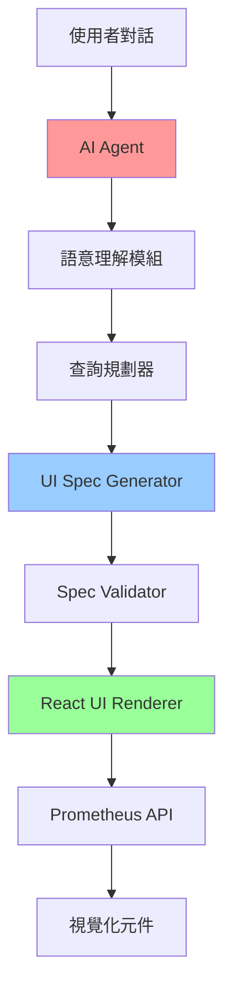
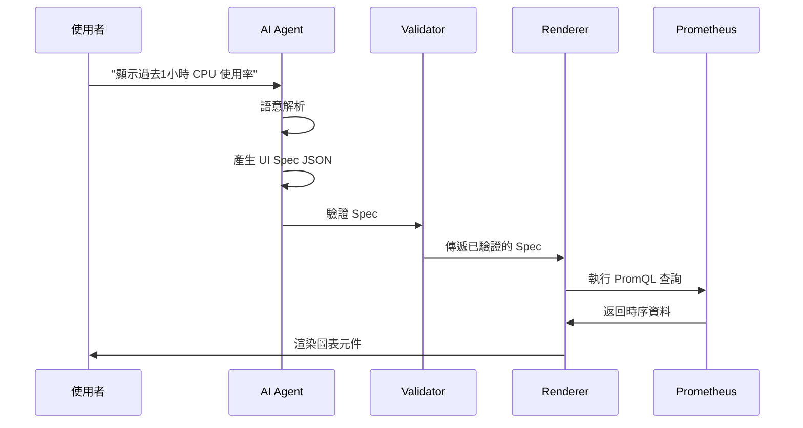

# AI UI Agent 系統架構設計

## 核心理念

**不讓 AI 直接畫 UI，而是讓 AI 產生 UI 描述規格（UI Spec），再由程式轉譯成實際 UI**

這確保了系統的：
- ✅ 可維護性：規格化的 JSON 易於版本控制和審查
- ✅ 可控性：UI 渲染邏輯統一管理，避免 AI 產生不可預測的結果
- ✅ 安全性：透過 Schema 驗證和白名單機制防止注入攻擊

---

## 系統架構總覽



---

## 資料流程



---

## 核心組件設計

### 1. UI Spec JSON Schema

UI Spec 是整個系統的核心介面，定義了 AI 與 Renderer 之間的溝通協定。

#### 基礎結構

```json
{
  "version": "1.0",
  "metadata": {
    "title": "CPU 使用率監控",
    "description": "過去1小時的 CPU 使用率趨勢",
    "created_at": "2026-01-05T15:00:00Z",
    "intent": "show_metric_trend"
  },
  "layout": {
    "type": "grid",
    "columns": 12,
    "gap": "md"
  },
  "widgets": [
    {
      "id": "widget-1",
      "type": "time_series_chart",
      "position": {"row": 1, "col": 1, "colspan": 12, "rowspan": 6},
      "config": {
        "title": "CPU 使用率",
        "chart_type": "line",
        "y_axis_unit": "percent",
        "legend_position": "bottom"
      },
      "data_source": {
        "type": "prometheus",
        "query": "rate(node_cpu_seconds_total{mode!=\"idle\"}[5m]) * 100",
        "time_range": {
          "start": "now-1h",
          "end": "now",
          "step": "30s"
        }
      }
    }
  ],
  "actions": [
    {
      "id": "action-1",
      "type": "time_range_picker",
      "label": "調整時間範圍"
    }
  ]
}
```

#### Widget 類型系統

| Widget Type | 說明 | 適用場景 |
|------------|------|---------|
| `time_series_chart` | 時序圖表 | CPU、記憶體、網路流量趨勢 |
| `metric_card` | 指標卡片 | 單一數值顯示（當前值、最大值、平均值） |
| `gauge` | 儀表盤 | 使用率、百分比 |
| `table` | 資料表格 | Top N 查詢結果 |
| `heatmap` | 熱力圖 | 多維度資料分佈 |
| `bar_chart` | 長條圖 | 分類資料比較 |
| `alert_panel` | 警示面板 | 警示規則與觸發狀態 |

---

### 2. AI Agent 語意理解模組

#### 職責

Agent **不是**畫 UI，而是：

1. **理解使用者要「看什麼資料」**
   - 解析自然語言意圖
   - 識別關鍵實體（時間範圍、metric 名稱、聚合方式）

2. **判斷資料來源與查詢邏輯**
   - 將需求轉換為 PromQL
   - 決定資料聚合方式（avg, sum, rate, max 等）

3. **選擇適合的呈現方式**
   - 根據資料特性選擇 Widget 類型
   - 設計合理的視覺化配置

#### 實現方式

使用 LLM（如 GPT-4、Claude）+ Few-shot Prompting：

```python
# 簡化範例
SYSTEM_PROMPT = """
你是一個 Prometheus 監控系統的 UI Spec 產生器。
使用者會用自然語言描述他們想看的監控資料，你需要：

1. 解析意圖並提取關鍵參數
2. 產生符合 UI Spec Schema 的 JSON
3. 選擇最適合的視覺化類型

規則：
- 只輸出有效的 JSON，不要有額外文字
- PromQL 必須正確且安全
- 時間範圍必須明確
- 禁止執行寫入操作
"""

FEW_SHOT_EXAMPLES = [
    {
        "input": "顯示過去1小時的 CPU 使用率",
        "output": {...}  # 完整的 UI Spec JSON
    },
    {
        "input": "我想看哪台機器記憶體快滿了",
        "output": {...}
    }
]
```

#### 安全性考量

- **PromQL 白名單**：只允許讀取類查詢，禁止刪除、修改操作
- **參數驗證**：時間範圍、Step 值必須在合理範圍內
- **查詢複雜度限制**：限制查詢的時間範圍和資料點數量

---

### 3. Prometheus 資料查詢抽象層

#### 查詢介面

```typescript
interface PrometheusDataSource {
  type: 'prometheus';
  query: string;  // PromQL
  time_range: {
    start: string;  // RFC3339 or relative (now-1h)
    end: string;
    step?: string;  // 資料點間隔
  };
  label_filters?: Record<string, string>;
}

interface QueryExecutor {
  execute(spec: PrometheusDataSource): Promise<TimeSeriesData>;
  validate(query: string): boolean;
  sanitize(query: string): string;
}
```

#### 安全機制

```typescript
class SafePrometheusExecutor implements QueryExecutor {
  private readonly FORBIDDEN_PATTERNS = [
    /delete/i,
    /drop/i,
    /—exec/i
  ];
  
  validate(query: string): boolean {
    // 檢查是否包含危險操作
    return !this.FORBIDDEN_PATTERNS.some(p => p.test(query));
  }
  
  async execute(spec: PrometheusDataSource) {
    if (!this.validate(spec.query)) {
      throw new SecurityError('Forbidden query pattern detected');
    }
    
    // 執行查詢
    const response = await fetch(`${PROM_URL}/api/v1/query_range`, {
      method: 'POST',
      body: JSON.stringify({
        query: spec.query,
        start: this.parseTime(spec.time_range.start),
        end: this.parseTime(spec.time_range.end),
        step: spec.time_range.step || '15s'
      })
    });
    
    return this.transformData(await response.json());
  }
}
```

---

### 4. UI Spec Validator

在渲染前驗證 Spec 的有效性，防止錯誤和安全漏洞。

```typescript
import Ajv from 'ajv';

const UI_SPEC_SCHEMA = {
  type: 'object',
  required: ['version', 'widgets'],
  properties: {
    version: { type: 'string', pattern: '^\\d+\\.\\d+$' },
    metadata: {
      type: 'object',
      properties: {
        title: { type: 'string', maxLength: 200 },
        description: { type: 'string', maxLength: 1000 }
      }
    },
    widgets: {
      type: 'array',
      minItems: 1,
      maxItems: 20,  // 限制單頁 widget 數量
      items: {
        type: 'object',
        required: ['id', 'type', 'data_source'],
        properties: {
          type: {
            type: 'string',
            enum: ['time_series_chart', 'metric_card', 'gauge', 'table', 'heatmap', 'bar_chart', 'alert_panel']
          }
          // ... 更多欄位定義
        }
      }
    }
  }
};

const ajv = new Ajv();
const validateSpec = ajv.compile(UI_SPEC_SCHEMA);

export function validateUISpec(spec: unknown): UISpec {
  if (!validateSpec(spec)) {
    throw new ValidationError(validateSpec.errors);
  }
  return spec as UISpec;
}
```

---

### 5. React UI Renderer 架構

#### 核心概念

Renderer 是一個「spec-driven」的渲染引擎，根據 UI Spec 動態組裝 React 元件。

```typescript
// Renderer 入口
interface UIRendererProps {
  spec: UISpec;
  onError?: (error: Error) => void;
}

const UIRenderer: React.FC<UIRendererProps> = ({ spec, onError }) => {
  const validatedSpec = useMemo(() => {
    try {
      return validateUISpec(spec);
    } catch (e) {
      onError?.(e);
      return null;
    }
  }, [spec]);
  
  if (!validatedSpec) return <ErrorFallback />;
  
  return (
    <div className="ui-renderer">
      <LayoutEngine layout={validatedSpec.layout}>
        {validatedSpec.widgets.map(widget => (
          <WidgetFactory key={widget.id} widget={widget} />
        ))}
      </LayoutEngine>
    </div>
  );
};
```

#### Widget Factory

```typescript
const WidgetFactory: React.FC<{widget: WidgetSpec}> = ({ widget }) => {
  const Component = useMemo(() => {
    switch (widget.type) {
      case 'time_series_chart':
        return TimeSeriesChart;
      case 'metric_card':
        return MetricCard;
      case 'gauge':
        return GaugeWidget;
      // ... 其他類型
      default:
        return UnsupportedWidget;
    }
  }, [widget.type]);
  
  return <Component spec={widget} />;
};
```

#### 資料載入與快取

```typescript
const TimeSeriesChart: React.FC<{spec: TimeSeriesWidgetSpec}> = ({ spec }) => {
  const { data, loading, error } = usePrometheusQuery(spec.data_source);
  
  if (loading) return <Skeleton />;
  if (error) return <ErrorDisplay error={error} />;
  
  return (
    <div className="widget-container">
      <h3>{spec.config.title}</h3>
      <Chart
        type={spec.config.chart_type}
        data={data}
        options={spec.config}
      />
    </div>
  );
};

// React Query 實現資料獲取與快取
function usePrometheusQuery(dataSource: PrometheusDataSource) {
  return useQuery({
    queryKey: ['prometheus', dataSource.query, dataSource.time_range],
    queryFn: () => queryExecutor.execute(dataSource),
    staleTime: 30000,  // 30秒快取
    refetchInterval: 60000  // 1分鐘自動刷新
  });
}
```

---

### 6. OpenAPI 規格定義

提供 RESTful API 供前端與 AI Agent 溝通。

```yaml
openapi: 3.0.0
info:
  title: UI Agent API
  version: 1.0.0

paths:
  /api/v1/spec/generate:
    post:
      summary: 根據自然語言產生 UI Spec
      requestBody:
        required: true
        content:
          application/json:
            schema:
              type: object
              properties:
                query:
                  type: string
                  example: "顯示過去1小時的 CPU 使用率"
                context:
                  type: object
                  description: 額外上下文（如使用者身份、預設時區）
      responses:
        200:
          description: 成功產生 UI Spec
          content:
            application/json:
              schema:
                $ref: '#/components/schemas/UISpec'
        400:
          description: 請求格式錯誤或無法理解的查詢

  /api/v1/spec/validate:
    post:
      summary: 驗證 UI Spec 是否有效
      requestBody:
        required: true
        content:
          application/json:
            schema:
              $ref: '#/components/schemas/UISpec'
      responses:
        200:
          description: Spec 有效
        400:
          description: Spec 無效，返回錯誤詳情

  /api/v1/data/execute:
    post:
      summary: 執行資料查詢（由 Renderer 呼叫）
      requestBody:
        required: true
        content:
          application/json:
            schema:
              $ref: '#/components/schemas/DataSource'
      responses:
        200:
          description: 查詢成功
          content:
            application/json:
              schema:
                type: object
                properties:
                  data:
                    type: array
                  metadata:
                    type: object

components:
  schemas:
    UISpec:
      type: object
      # ... 完整的 Schema 定義
    
    DataSource:
      type: object
      discriminator:
        propertyName: type
      oneOf:
        - $ref: '#/components/schemas/PrometheusDataSource'
```

---

### 7. 安全性與權限控制

#### 威脅模型

| 威脅 | 風險 | 緩解措施 |
|------|------|----------|
| PromQL 注入 | AI 產生惡意查詢 | 白名單驗證、查詢複雜度限制 |
| XSS 攻擊 | UI Spec 包含惡意腳本 | Schema 驗證、內容沙箱化 |
| 資料洩露 | 未授權存取敏感 metrics | 基於角色的存取控制（RBAC） |
| 資源耗盡 | 過大的查詢範圍 | 速率限制、查詢超時 |

#### 實現機制

```typescript
// RBAC 中介層
class PermissionChecker {
  async canAccessMetric(user: User, metric: string): Promise<boolean> {
    const allowedMetrics = await this.getUserMetricsWhitelist(user);
    return allowedMetrics.includes(metric) || 
           allowedMetrics.some(pattern => new RegExp(pattern).test(metric));
  }
  
  validateTimeRange(range: TimeRange): void {
    const duration = parseTimeRange(range.start, range.end);
    if (duration > MAX_QUERY_DURATION) {
      throw new RateLimitError('Time range too large');
    }
  }
}

// API 層整合
app.post('/api/v1/spec/generate', async (req, res) => {
  const user = await authenticate(req);
  const spec = await aiAgent.generate(req.body.query);
  
  // 驗證使用者權限
  for (const widget of spec.widgets) {
    const allowed = await permissionChecker.canAccessMetric(
      user, 
      extractMetricFromQuery(widget.data_source.query)
    );
    if (!allowed) {
      return res.status(403).json({ error: 'Forbidden metric access' });
    }
  }
  
  res.json(spec);
});
```

---

### 8. 效能優化策略

#### 查詢優化

```typescript
// 查詢結果快取
const queryCache = new LRUCache<string, TimeSeriesData>({
  max: 500,
  ttl: 60000  // 1分鐘
});

// 批次查詢合併
class QueryBatcher {
  private pending: Map<string, Promise<any>> = new Map();
  
  async execute(query: string): Promise<any> {
    if (this.pending.has(query)) {
      return this.pending.get(query);
    }
    
    const promise = this.doExecute(query);
    this.pending.set(query, promise);
    
    promise.finally(() => this.pending.delete(query));
    return promise;
  }
}
```

#### 前端優化

- **虛擬滾動**：大型表格使用 react-window
- **圖表降採樣**：超過 1000 個資料點時自動降採樣
- **懶載入**：Widget 進入視窗才載入資料
- **增量更新**：只更新變化的資料，不重新渲染整個組件

---

### 9. 錯誤處理與降級機制

#### 錯誤分類

```typescript
enum ErrorSeverity {
  CRITICAL = 'critical',  // 整個頁面無法使用
  HIGH = 'high',          // 重要功能失效
  MEDIUM = 'medium',      // 部分 Widget 失效
  LOW = 'low'             // 不影響核心功能
}

class ErrorHandler {
  handle(error: Error, severity: ErrorSeverity) {
    switch (severity) {
      case ErrorSeverity.CRITICAL:
        this.showErrorPage(error);
        this.alertOps(error);
        break;
      case ErrorSeverity.HIGH:
        this.showErrorBanner(error);
        this.logError(error);
        break;
      case ErrorSeverity.MEDIUM:
        this.showWidgetError(error);
        break;
      case ErrorSeverity.LOW:
        this.logWarning(error);
        break;
    }
  }
}
```

#### 降級策略

```typescript
const TimeSeriesChart: React.FC = ({ spec }) => {
  const { data, error } = usePrometheusQuery(spec.data_source);
  
  if (error) {
    // 降級顯示：顯示最後一次成功的快取資料
    const cachedData = getCachedData(spec.data_source);
    if (cachedData) {
      return (
        <>
          <WarningBanner>顯示快取資料（可能不是最新）</WarningBanner>
          <Chart data={cachedData} />
        </>
      );
    }
    
    // 最終降級：顯示錯誤但保持 UI 結構
    return <ErrorWidget message={error.message} />;
  }
  
  return <Chart data={data} />;
};
```

---

## 技術棧總結

| 層級 | 技術選型 | 說明 |
|------|---------|------|
| 前端框架 | React 18+ | 使用 Hooks、Suspense、並發渲染 |
| 狀態管理 | React Query | 伺服器狀態管理與快取 |
| 圖表庫 | Apache ECharts / Chart.js | 豐富的圖表類型 |
| 樣式 | Tailwind CSS + shadcn/ui | 快速開發高品質 UI |
| API 規範 | OpenAPI 3.0 | 標準化 API 定義 |
| 後端框架 | Node.js + Express / FastAPI | 輕量、支援 async |
| AI 模型 | OpenAI GPT-4 / Anthropic Claude | 語意理解與生成 |
| 資料來源 | Prometheus | 時序資料庫 |
| Schema 驗證 | Ajv / Zod | JSON Schema 驗證 |
| 測試 | Vitest + Playwright | 單元測試與 E2E 測試 |

---

## 開發階段規劃

### Phase 1: 核心基礎設施
- 定義 UI Spec Schema v1.0
- 實現 Spec Validator
- 建立基礎 OpenAPI 定義
- 實現 Prometheus 查詢執行器

### Phase 2: AI Agent 開發
- 設計 Prompt Engineering 策略
- 實現語意理解模組
- 建立 Few-shot 範例庫
- 整合 LLM API

### Phase 3: React Renderer
- 實現 Widget Factory
- 開發基礎 Widget 組件（至少支援 3-5 種）
- 整合 React Query 資料管理
- 實現 Layout Engine

### Phase 4: 安全與效能
- 實現 RBAC 權限控制
- 建立查詢白名單機制
- 實現快取策略
- 效能監控與優化

### Phase 5: 測試與部署
- 撰寫單元測試與整合測試
- E2E 測試覆蓋主要場景
- 建立 CI/CD Pipeline
- 部署到生產環境

---

## 成功指標

- ✅ AI 產生的 UI Spec 準確率 > 90%
- ✅ 頁面載入時間 < 2 秒
- ✅ Widget 渲染時間 < 500ms
- ✅ 零安全漏洞（通過滲透測試）
- ✅ 使用者滿意度 > 4.5/5

---

## 風險與挑戰

| 風險 | 影響 | 應對措施 |
|------|------|----------|
| LLM 輸出不穩定 | AI 產生錯誤 Spec | 嚴格的 Schema 驗證 + Fallback 機制 |
| Prometheus 效能瓶頸 | 查詢過慢 | 查詢優化 + 多層快取 |
| Widget 類型擴充困難 | 維護成本高 | 設計良好的抽象介面 |
| 使用者意圖模糊 | AI 理解錯誤 | 互動式確認機制 |

---

## 延伸思考

### 未來可擴充方向

1. **多資料源支援**
   - 除了 Prometheus，支援 ElasticSearch、InfluxDB、MySQL 等
   - 跨資料源聯合查詢

2. **AI 互動式調整**
   - 使用者可以對話方式調整圖表
   - "把時間範圍改成 3 小時" → 即時更新

3. **儀表板模板庫**
   - 常用場景的預設模板
   - 使用者可分享與複製儀表板

4. **警示規則產生**
   - AI 根據對話產生 Prometheus Alertmanager 規則
   - 自動設定閾值與通知管道

5. **自然語言查詢歷史**
   - 記錄使用者查詢模式
   - 個人化推薦與自動補全

---

## 結論

這個架構的核心價值在於「分離關注點」：

- **AI Agent** 專注於理解意圖與規劃
- **UI Spec** 作為標準化的中間格式
- **Renderer** 專注於高效、安全的渲染

這樣的設計讓系統：
- 每個組件都可獨立測試與優化
- 容易擴充新的 Widget 類型或資料源
- AI 的不確定性被限制在 Spec 產生階段，不會影響 UI 穩定性

這是一個「可長期維護、可控、安全」的 AI UI 解決方案。
